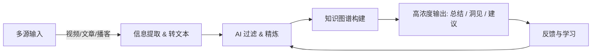

# 我的第二大脑计划

---

## 为什么需要第二大脑？

在日常生活和工作中，我常常有一种感觉：  
**大脑不够用了。**

比如：
- 工作中需要快速掌握新技能，但学习材料散落在各种视频、文档、社区里，效率很低。  
- 想关注前沿趋势，但短视频平台的信息往往碎片化、娱乐化，想找到真正有价值的内容却要耗费大量时间。  
- 与人沟通时，我常常希望能记住更多细节，组织出更有逻辑的表达，却发现思路总是被打断。  
- 明明看过很多优质内容，但过一段时间就忘了，没能形成可复用的知识体系。

简而言之，**时间有限，而信息太多**。我希望把大脑从一些“低效的处理环节”里解放出来，把更多精力放在真正重要的思考和创造上。

于是，我萌生了一个念头：  
👉 **如果能有一个“第二大脑”，帮我捕捉、筛选、整理、提炼信息，并随时为我提供高浓度的洞见，那该有多好！**

---

## 现有产品与不足

目前市面上已经有一些类似方向的产品或尝试：

- **笔记类应用**（Notion、Obsidian、Roam Research）：  
  擅长存储和组织知识，但在信息自动化获取和智能提炼方面不足，需要大量手动维护。  

- **AI 助手类应用**（ChatGPT、Claude、Cursor 等）：  
  在单次对话和写作上表现优秀，但缺乏长期记忆和跨领域整合，很难成为真正的“思维伙伴”。  

- **信息聚合工具**（RSS、Readwise、Pocket）：  
  可以帮忙收集文章，但无法自动判断价值，更无法提炼成结构化知识。  

这些产品的共同问题是：  
**要么太工具化，缺少智能；要么太智能化，却缺少体系。**

---

## 我希望构建的“第二大脑”

我设想中的“第二大脑”，应该具有以下特征：

- **多源输入**：能够从视频、文章、播客、对话中提取有效信息，并过滤噪音。  
- **智能整理**：不只是存储，而是形成结构化知识图谱，方便检索与联想。  
- **高效输出**：能够根据需求快速生成高浓度内容，而不是给我一堆未经处理的原始数据。  
- **长期演进**：随着时间积累，它应该越来越懂我，成为真正的“认知助手”。  

---

## 一个简单的示意图

下面是一张用 Mermaid 画的简易示意图，展示了我理想中的“第二大脑”流程：

## 未来的展望

未来的“第二大脑”，不仅仅是一个工具，而是一种全新的生活与工作方式。

它会让我从“被动接收信息”转向“主动驾驭信息”。

它会成为我和未来世界之间的桥梁，帮我提前洞察趋势，做出更优决策。

它甚至可能成为某种“集体智能”的一部分，让人与人之间的知识共享更高效。

简而言之，第二大脑不只是一个系统，而是我未来十年最重要的个人项目。
